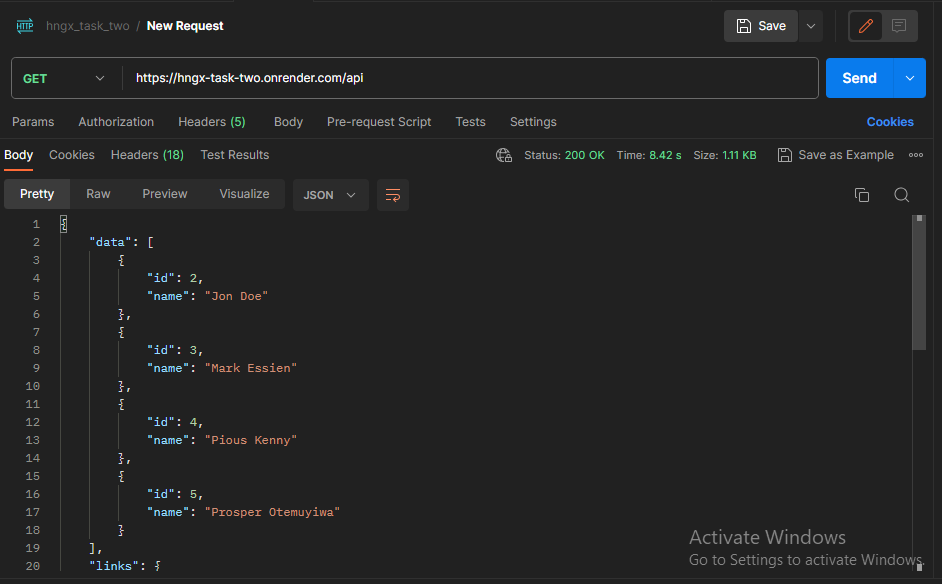
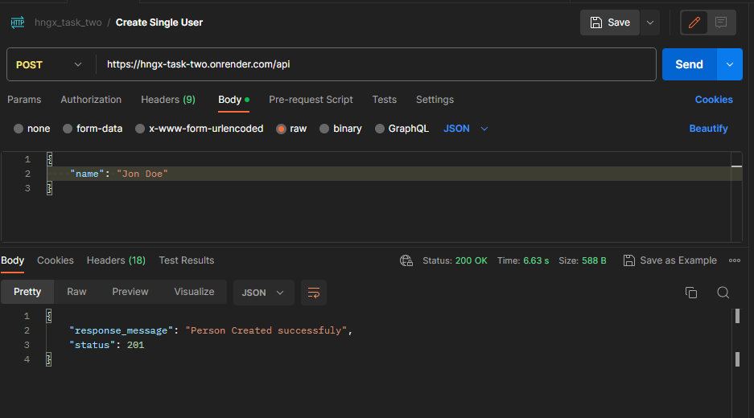
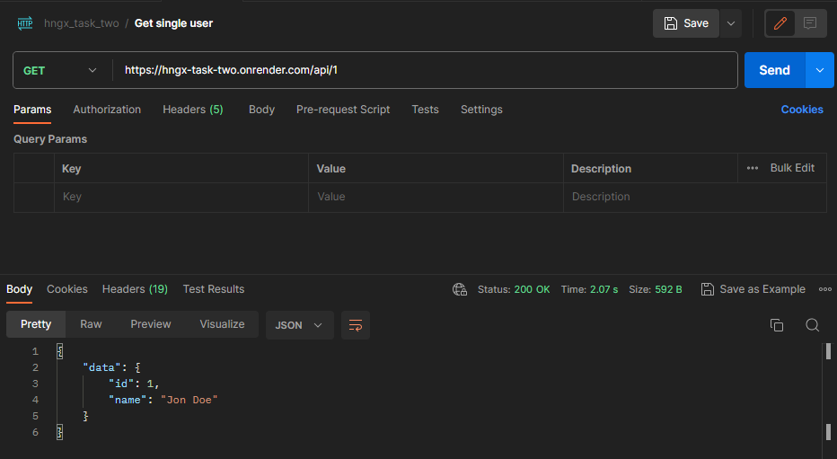
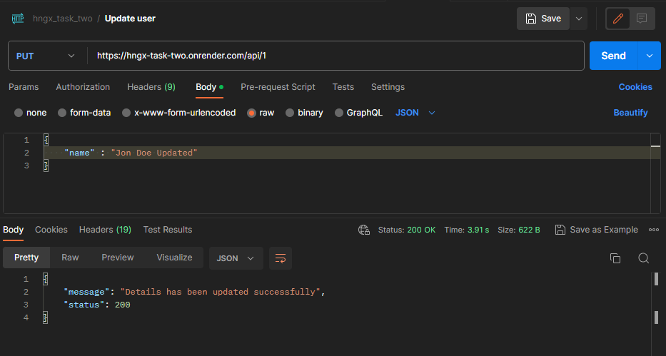

# Simple CRUD API Documentation

Welcome to the CRUD API documentation Laravel application. This API allows you to create, read, update, and delete person records.

## Table of Contents

-   [Getting Started](#getting-started)
    -   [Prerequisites](#prerequisites)
    -   [Installation](#installation)
-   [API Endpoints](#api-endpoints)
-   [Request and Response Formats](#request-and-response-formats)
-   [Sample Usage](#sample-usage)
-   [License](#license)

## Getting Started

### Prerequisites

Before you start, make sure you have the following prerequisites installed on your system:

-   PHP (>= 8.0)
-   Composer
-   Laravel (>= 8.x)
-   Database ( MySQL or PostgreSQL)

### Installation

1. Clone this repository:

    ```bash
    git clone https://github.com/piouskenny/hngx_task_two.git
    ```

2. Install PHP dependencies using Composer:

    ```bash
    composer install
    ```

3. Create a .env file by copying the .env.example file and configure your database settings:
    ```bash
    cp .env.example .env
    ```
    Configure the database config variables as follows:
    ```
    DB_CONNECTION=mysql
    DB_HOST=127.0.0.1
    DB_PORT=3306
    DB_DATABASE=laravel
    DB_USERNAME=root
    DB_PASSWORD=
    ```
4. Run the migrations:
    ```bash
    php artisan migrate
    ```
5. Start the development server:

    ```bash
    php artisan serve

    ```

    Laravel API is now up and running on {http://localhost:8000} which is the base url!

### API Endpoints

### Request and Response Formats

The API uses JSON for both requests and responses. The following table describes the JSON format for the requests and responses:

<table>
    <thead>
        <th> Requests </th>
        <th> Response </th>
    </thead>
    <tbody>
            <tr>
            <td>GET /api</td>
            <td>200 Collection of All Persons</td>
        </tr>
        <tr>
            <td>POST /api</td>
            <td>201 Person Created successfuly</td>
        </tr>

        <tr>
            <td>GET /api/{user_id}</td>
            <td>200 OK with single Person details</td>
        </tr>
        <tr>
            <td>PUT /api/{user_id}</td>
            <td>200 OK Details has been updated successfully</td>
        </tr>
        <tr>
            <td>DELETE /api/{user_id}</td>
            <td>200 Okh user_id was deleted successfuly</td>
        </tr>
    </tbody>

</table>

### Sample Usage


## Displaying all Persons (200 OK)

 


## Adding a new person (201 Created)

 


## Fetch the details of a person (200 OK)

 

## Update the details of an existing person (200 OK)

 


## Remove a person (200 Ok)

 

### License

The MIT License (MIT)
